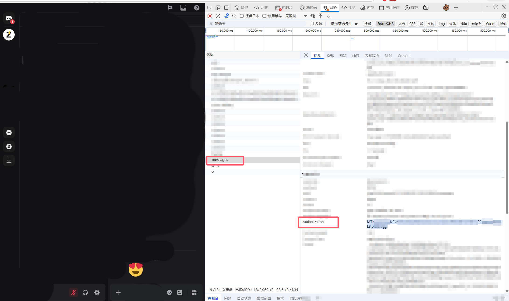

# ZaiBridge

ZaiBridge 是一个功能完整的 OpenAI 兼容 API 服务网关。它允许你管理 Discord Token，自动将其转换为 zai.is 的访问凭证，并提供标准的 OpenAI 接口供第三方客户端调用。

**作者**: EraAsh

## ✨ 最新更新

### v2.0 - 完整支持 x-zai-darkknight 请求头

- ✅ **修复 x-zai-darkknight 请求头验证**：现已完整支持 zai.is 新增的 `x-zai-darkknight` 请求头验证机制
- ✅ **自动提取 darkknight 值**：在 OAuth 登录流程中自动提取并存储 `x-zai-darkknight` 值
- ✅ **代码混淆保护**：新增 `obfuscator.py` 模块，对敏感字符串和 token 进行混淆保护
- ✅ **增强安全性**：所有敏感信息在日志中自动脱敏显示
- ✅ **数据库迁移**：自动添加 `zai_darkknight` 字段到现有数据库

## 轻量化版本

如果你只需要"自动刷新 Discord Token 并推送到NewAPI"这一精简能力，可以使用仓库内的 `自动刷新token推送到newapi` 目录：

- `自动刷新token推送到newapi` 为轻量化版本，专注于 Token 自动刷新与推送，适合资源受限或仅需 Token 分发的场景；

## 功能特性

- **多 Token 管理**：支持批量添加、删除、禁用 Discord Token。
- **自动保活**：后台调度器自动检测并刷新过期的 Zai Token。
- **OpenAI 兼容**：提供 `/v1/chat/completions` 和 `/v1/models` 接口。
- **负载均衡**：API 请求会自动轮询使用当前活跃的 Token。
- **WebUI 面板**：
  - **Token 列表**：实时查看 Token 状态、剩余有效期。
  - **系统配置**：修改管理员密码、API Key、代理设置、错误重试策略等。
  - **请求日志**：详细记录 API 调用的耗时、状态码和使用的 Token。
- **Docker 部署**：提供 Dockerfile 和 docker-compose.yml，一键部署。

## 快速开始

### 获取 Discord Token

1. 在 Discord 中按 F12 打开开发者工具
2. 切换到 "网络" (Network) 标签
3. 在任意群组发送一条消息
4. 在网络请求中找到该消息的请求
5. 在 "请求标头" (Request Headers) 中找到 `Authorization` 字段
6. 复制该值作为 Discord Token



**使用方式**：
- 在管理面板中点击"新增 Token"
- 粘贴 Discord Token
- 系统将自动登录 zai.is 并获取 API Token
- 无需手动提取，完全自动化

### 获取 API Token

1. 访问 [zai.is](https://zai.is) 并使用 Discord 登录
2. 登录成功后，按 F12 打开开发者工具
3. 切换到 "网络" (Network) 标签
4. 刷新页面或进行任意 API 调用
5. 在网络请求中找到 API 请求
6. 在 "请求标头" (Request Headers) 中找到：
   - `Authorization: Bearer <your_token>` - 这是 API Token
   - `x-zai-darkknight: <your_darkknight>` - 这是 darkknight 值

**注意**：本工具会自动通过 Discord Token 获取 API Token 和 darkknight 值，无需手动提取。

### 方式一：Docker Compose 部署（推荐）

1. 克隆或下载本项目代码。
2. 确保已安装 Docker 和 Docker Compose。
3. 在项目根目录下运行：

```bash
git clone https://github.com/EraAsh/ZaiBridge.git && cd ZaiBridge
```

```bash
docker-compose up -d
```

1. 服务启动后，访问 `http://localhost:5000` 进入管理后台。

### 方式二：源码部署

1. 确保已安装 Python 3.10+。
2. 安装依赖：

```bash
pip install -r requirements.txt
```

3. 启动服务：

```bash
python app.py
```

## 配置说明

### 环境变量

| 变量名 | 默认值 | 说明 |
| :--- | :--- | :--- |
| `DATABASE_URI` | `sqlite:////app/instance/zai2api.db` | 数据库连接字符串 |
| `SECRET_KEY` | `your-secret-key...` | Flask Session 密钥，建议修改 |
| `TZ` | `Asia/Shanghai` | 容器时区 |

## 管理面板功能

1. **Token 管理**：
    - 点击"新增 Token"输入 Discord Token。
    - 系统会自动尝试获取 Zai Token。
    - 点击"一键刷新 ZaiToken"可强制刷新所有 Token。
2. **系统配置**：
    - 调整"错误封禁阈值"和"错误重试次数"以优化稳定性。
    - 调整 Token 刷新间隔。
3. **请求日志**：
    - 查看最近的 API 请求记录。

## 技术实现

### Token 获取流程

1. **Discord OAuth 登录**：使用 Discord Token 进行后端 OAuth 登录
2. **提取 JWT Token**：从 OAuth 回调中提取 zai.is 的 JWT Token
3. **提取 darkknight 值**：自动从响应中提取 `x-zai-darkknight` 值
4. **存储到数据库**：将 Token 和 darkknight 值存储到数据库
5. **API 调用**：在调用 zai.is API 时自动添加 `x-zai-darkknight` 请求头

### 代码混淆保护

项目使用 `obfuscator.py` 模块提供以下保护：

- **字符串混淆**：敏感字符串（如 API 端点、请求头名称）使用 base64 + XOR 混淆
- **Token 脱敏**：所有 token 在日志中自动脱敏显示
- **哈希保护**：敏感数据的哈希值用于日志记录

### 数据库结构

```python
class Token(db.Model):
    id = db.Column(db.Integer, primary_key=True)
    email = db.Column(db.String(120), nullable=True)
    discord_token = db.Column(db.String(512), nullable=False)
    zai_token = db.Column(db.Text, nullable=True)  # JWT Token
    zai_darkknight = db.Column(db.String(256), nullable=True)  # x-zai-darkknight 值
    at_expires = db.Column(db.DateTime, nullable=True)
    # ... 其他字段
```

## 常见问题

### Q: 为什么需要 x-zai-darkknight 请求头？

A: zai.is 在近期更新中新增了 `x-zai-darkknight` 请求头验证，这是为了防止未授权的 API 调用。本工具已完整支持该验证机制。

### Q: 如何验证 darkknight 值是否正确？

A: 在管理面板的 Token 列表中，每个 Token 都会显示其 `zai_darkknight` 值。如果该值为空，说明提取失败，需要重新刷新 Token。

### Q: Token 刷新失败怎么办？

A: 请检查以下几点：
1. Discord Token 是否有效
2. 网络连接是否正常
3. 是否需要配置代理
4. 查看 Token 列表中的错误信息

### Q: 如何提高安全性？

A: 建议：
1. 定期更换 Discord Token
2. 使用强密码保护管理面板
3. 配置 HTTPS 访问
4. 定期备份数据库

## Star History

[](https://www.star-history.com/#EraAsh/ZaiBridge&type=date&legend=top-left)

## 免责声明

本项目仅供逆向学习和研究使用。使用者应自行承担使用本工具产生的所有风险和责任。请遵守相关服务条款。
